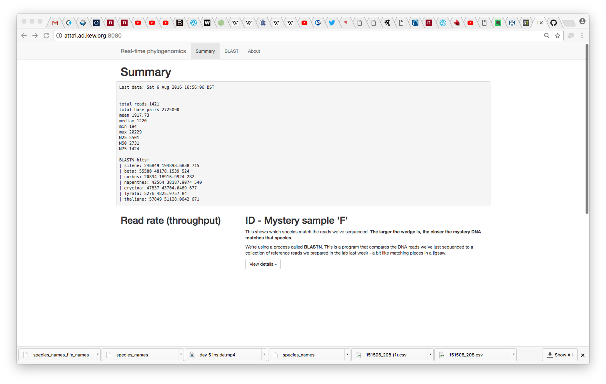
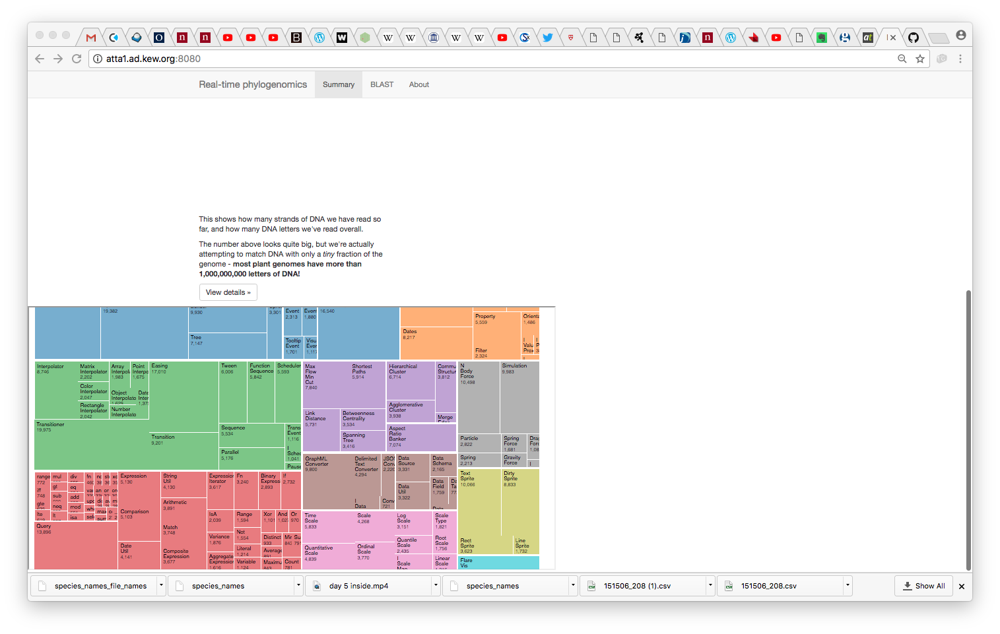

# MinION-Hackathon
Getting a Taxonomy Treemap streaming from a MinION device

## Overall

We wanted to come up with a real-time platform to analyse (classify) and visualise a metagenome against ~500 fungal genomes.

This consists of:

 - A subset of the NCBI taxonomy pulled by `horrible_ncbi_taxonomy/ncbi_ids.Rmd` which attempts to get a taxonomy (proxy for phylogeny) for the JGI fungal genomes
 - A directory watcher (`SimpleDirWatcher.jar`) which triggers a bash script (`do_metahack.sh`) when new reads appear in the `/input` directory
 - An analysis pipeline forked from `do_metahack.sh` which (at present) BLASTs reads against the 500 (actually 300) genome database
 - A D3-based visualiser which uses a treemap paradigm to classify reads and cascade confidence information up the taxonomy to aggregate ID information by genus/family/phylum
 
## Input
 
Sequence reads in FASTA
 
## Output
 
Served to html:
 

## Next steps

There's a google doc with more but:
 - [ ] Programatically pull taxonomy more flexibly
 - [ ] Debug D3 tree expansion
 - [ ] Refine actual ID engine
